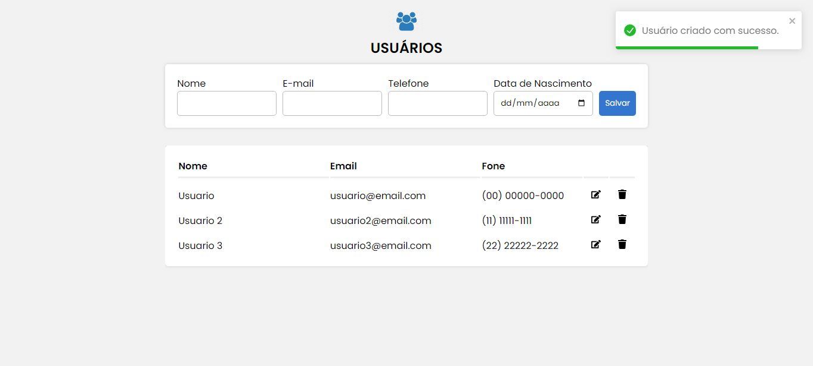

<h4 align="center"> 
	🚧 CRUD Cadastro de Usuários 🚀 🚧
</h4>

<p align="center">
 <a href="#-sobre-o-projeto">Sobre</a> •
 <a href="#-funcionalidades">Funcionalidades</a> •
 <a href="#-layout">Layout</a> • 
 <a href="#-como-executar-o-projeto">Como executar</a> • 
 <a href="#-tecnologias">Tecnologias</a> • 
 <a href="#-autor">Autor</a> • 
</p>

## 💻 Sobre o projeto

🧺 Aplicação Web desenvolvida para cadastrar as informações dos usuários, fornecendo nome, e-mail, telefone e data de nascimento.   

---

## ⚙️ Funcionalidades

- [x] Formulário para inserir as informações
- [x] Salvar no Banco de Dados
- [x] Lista com todos os usuários cadastrados
- [x] onde pode editar ou
- [x] excluir o usuário

---

## 🎨 Layout
  
  ### Web

  <p align="center">
    
    	
  </p>

---

## 🚀 Como executar o projeto

O projeto é dividido em duas partes:
1. Back End (pasta backend) 
2. Front End (pasta frontend)

### Pré-requisitos

Antes de começar, você vai precisar ter instalado em sua máquina as seguintes ferramentas:
[Docker][docker], [Node.js][nodejs]. 
Além disto é bom ter um editor para trabalhar com o código como [VSCode][vscode]

### Criar Banco de Dados (MySQL)

```bash

# Abra o Terminal na raiz do projeto e digite o comando 
$ docker-compose up

# O container será criado e iniciado


```

### Rodando o Back End (servidor)

```bash

# Abra o Terminal na pasta backend e rode o comando 
$ npm start

# A API estará disponível no endereço
http://localhost:8800/ 


```

### Rodando a aplicação web (Front End)

```bash

# Abra o Terminal na pasta frontend e rode o comando 
$ npm start

# A API estará disponível no endereço
http://localhost:3000/


```

### ⚠ Observação

Caso o Banco de dados de erro no usuário root, abra o MYSQL Workbench (ou outro SGBD de sua preferência)

```bash

# Execute a consulta 
ALTER USER 'root'@'localhost' IDENTIFIED WITH mysql_native_password BY 'senha';

# Em seguida execute a seguinte consulta para atualizar os privilégios
flush privileges;


```

---

## 🛠 Tecnologias

### Back End

[Node.js](https://nodejs.org/pt-br)

-   **[Express](https://expressjs.com/pt-br/)**
-   **[Nodemon](https://www.npmjs.com/package/nodemon)**
-   **[MySQL](https://www.mysql.com/)**
-   **[Docker](https://www.docker.com/)**

### Front End

[React](https://react.dev/)

-   **[Axios](https://axios-http.com/ptbr/docs/intro)**
-   **[React-icons](https://react-icons.github.io/react-icons/)**
-   **[React-Toastify](https://www.npmjs.com/package/react-toastify)**
-   **[Styled Components](https://styled-components.com/)**

## 🦸🏻‍♂️ Autor

<a href="https://github.com/gabrielszg">
  <p>@gabrielszg</p>
</a>
